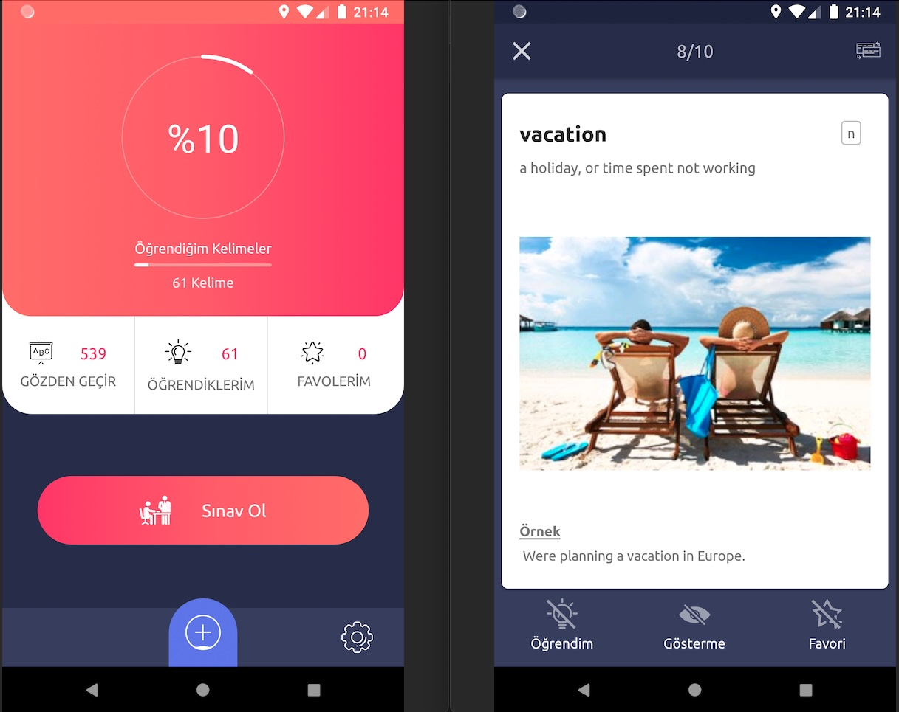

# Flash Card App

## This repository contains FlashCard app built for learning english words
PlayStore: https://play.google.com/store/apps/details?id=com.mutlak.metis.wordmem



## Architecture
The architecture of this application relies and complies with the following points below:
* Pattern [Model-View-Presenter](https://en.wikipedia.org/wiki/Model%E2%80%93view%E2%80%93presenter)(MVVM) which facilitates a separation of development of the graphical user interface.
* [Android architecture components](https://developer.android.com/topic/libraries/architecture/) which help to keep the application robust, testable, and maintainable.

## Technologies used:

* [RxJava](https://github.com/ReactiveX/RxJava) use RxJava to replace the thread (Disk and Network I/O)
* [RxAndroid](https://github.com/ReactiveX/RxAndroid) Android specific bindings
* [Retrofit](https://square.github.io/retrofit/) a REST Client for Android which makes it relatively easy to retrieve and upload JSON (or other structured data) via a REST based webservice.
* [Dagger](https://dagger.dev/) for dependency injection.
* [Timber](https://github.com/JakeWharton/timber) - a logger with a small, extensible API which provides utility on top of Android's normal Log class.
* [Material Design](https://material.io/develop/android/docs/getting-started/) an adaptable system of guidelines, components, and tools that support the best practices of user interface design.
* [Android KTX](https://developer.android.com/kotlin/ktx) which helps to write more concise, idiomatic Kotlin code.
* [Preferences](https://developer.android.com/guide/topics/ui/settings) to create interactive settings screens.
* [RealmDb](https://realm.io/) for persistence
* [Glide](https://github.com/bumptech/glide) for image management

## LICENSE
```
MIT License

Copyright (c) 2020 Mahdi Hatami

Permission is hereby granted, free of charge, to any person obtaining a copy
of this software and associated documentation files (the "Software"), to deal
in the Software without restriction, including without limitation the rights
to use, copy, modify, merge, publish, distribute, sublicense, and/or sell
copies of the Software, and to permit persons to whom the Software is
furnished to do so, subject to the following conditions:

The above copyright notice and this permission notice shall be included in all
copies or substantial portions of the Software.

THE SOFTWARE IS PROVIDED "AS IS", WITHOUT WARRANTY OF ANY KIND, EXPRESS OR
IMPLIED, INCLUDING BUT NOT LIMITED TO THE WARRANTIES OF MERCHANTABILITY,
FITNESS FOR A PARTICULAR PURPOSE AND NONINFRINGEMENT. IN NO EVENT SHALL THE
AUTHORS OR COPYRIGHT HOLDERS BE LIABLE FOR ANY CLAIM, DAMAGES OR OTHER
LIABILITY, WHETHER IN AN ACTION OF CONTRACT, TORT OR OTHERWISE, ARISING FROM,
OUT OF OR IN CONNECTION WITH THE SOFTWARE OR THE USE OR OTHER DEALINGS IN THE
SOFTWARE.
```
